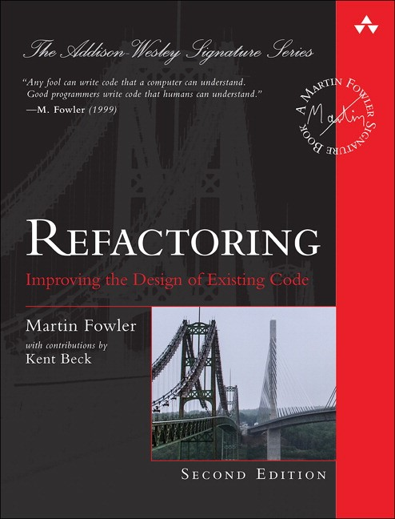

# Refactoring 2nd Edition

Example code re-written for my education purposes from Refactoring - Improving the design of existing code

[Buy it here](https://www.informit.com/store/refactoring-improving-the-design-of-existing-code-9780134757599)



## Run the code

```bash
deno run --allow-all ./main.ts
```
